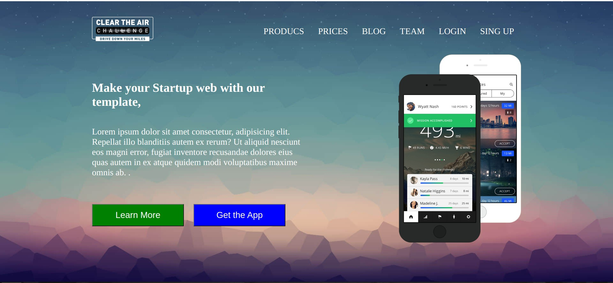

# Homepage - Aufgabe

### About Project

Das ist eine Homepageseite, die sie im Kurs als Übung gemacht wurde.

### How to use this Project

Das ist nur eine Übung.

##### Developed With

- [x] _HTML5_
- [x] _CSS_

---

### Contact

Mail: <mehmetgokce61@gmail.com> 
GitHub: (https://github.com/Mehmet-Gkc) 
LinkedIn: (https://www.linkedin.com/in/mehmet-g%C3%B6kce-63ba9a254/)

---

### Used Tools

- icons
- Google Fonts
- Visual Studio Code

